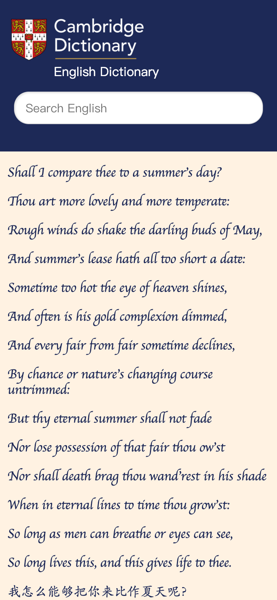

# cambridge-dictionary
nodejs cambridge dictionary using puppeteer to obtain vocabularies.

<br />


## DEMO
website: [http://78.141.218.138:7001/](http://78.141.218.138:7001/)

## Develop

```shell
git clone git@github.com:stephenkingsley/nodejs-cambridge-dictionary.git
cd nodejs-cambridge-dictionary
npm install
npm run dev
```

open `http://127.0.0.1:7001` and then you can modifies the value of search!

## APIs

#### /api/search?search=[vocabulary you want to search]

```json
{
    "success":true,
    "msg":"ok",
    "data":{
        "word":"elude",
        "posgram":"verb [ T ]",
        "usPhonogram":"/iˈluːd/",
        "ukPhonogram":"/iˈluːd/",
        "meaningList":[
            {
                "def":"If something that you want eludes you, you do not succeed in achieving it: ",
                "dsense":"elude verb [T] 
            (NOT ACHIEVE)
      ",
                "defBody":[
                    "The gold medal continues to elude her. They had minor breakthroughs but real success eluded them. ",
                    "They eluded the police by fleeing. ",
                    "I know who you mean but her name eludes me. ",
                    "The bear that had eluded capture for so long was caught at last. ",
                    "It was simply her misfortune that an Olympic medal eluded her in 1988. ",
                    "elusive memories "
                ]
            },
            {
                "def":"to not be caught by someone: ",
                "dsense":"elude verb [T] 
            (NOT BE CAUGHT)
      ",
                "defBody":[
                    "The gold medal continues to elude her. They had minor breakthroughs but real success eluded them. ",
                    "They eluded the police by fleeing. ",
                    "I know who you mean but her name eludes me. ",
                    "The bear that had eluded capture for so long was caught at last. ",
                    "It was simply her misfortune that an Olympic medal eluded her in 1988. ",
                    "elusive memories "
                ]
            },
            {
                "def":"If a piece of information eludes you, you cannot remember it: ",
                "dsense":"elude verb [T] 
            (NOT REMEMBER)
      ",
                "defBody":[
                    "The gold medal continues to elude her. They had minor breakthroughs but real success eluded them. ",
                    "They eluded the police by fleeing. ",
                    "I know who you mean but her name eludes me. ",
                    "The bear that had eluded capture for so long was caught at last. ",
                    "It was simply her misfortune that an Olympic medal eluded her in 1988. ",
                    "elusive memories "
                ]
            },
            {
                "def":"to avoid someone or something: ",
                "defBody":[
                    "The gold medal continues to elude her. They had minor breakthroughs but real success eluded them. ",
                    "They eluded the police by fleeing. ",
                    "I know who you mean but her name eludes me. ",
                    "The bear that had eluded capture for so long was caught at last. ",
                    "It was simply her misfortune that an Olympic medal eluded her in 1988. ",
                    "elusive memories "
                ]
            },
            {
                "def":"If something eludes you, you do not succeed in achieving it: ",
                "defBody":[
                    "The gold medal continues to elude her. They had minor breakthroughs but real success eluded them. ",
                    "They eluded the police by fleeing. ",
                    "I know who you mean but her name eludes me. ",
                    "The bear that had eluded capture for so long was caught at last. ",
                    "It was simply her misfortune that an Olympic medal eluded her in 1988. ",
                    "elusive memories "
                ]
            }
        ],
        "examples":[

        ]
    }
}
```

